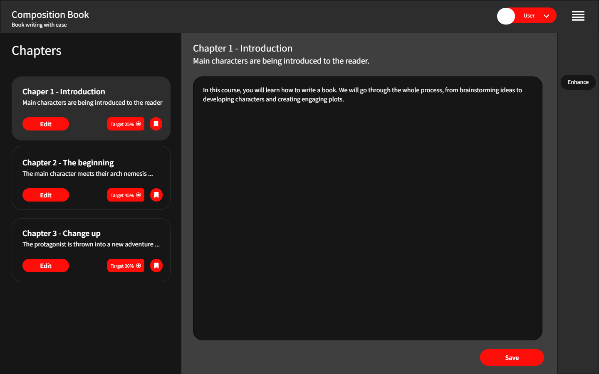

# Composition book

It is a composition, marketing and publishing platform for novice and experienced writers.
Its composition side combines the story world generator, the story world characters generator and a writing platform equipped with a set of tools every writer needs.
Its marketing side lets the writers promote their works online and connect with the readers. 
Thanks to the integrated Kindle Direct Publishing, the writers can sell their work with a click of a button.

Frontend Technology stack:
- Javascript/Typescript
- Vite
- PNPM
- Prettier and ESLint
- Bootstrap
- React.js
- Zedux/Context
- Firebase
- Monaco Editor
